# 🖥️ Aplikasi PyQt5 Tugas Week 9

## 👤 Data Mahasiswa
| Nama                      | NIM        |
|---------------------------|------------|
| M. ILHAM ABDUL SHALEH     | F1D022061  |

---

## 🛠️ Teknologi yang Digunakan
- Python 3.10+
- PyQt5

---

## 📋 Fitur Utama

| Fitur                                                                      | Status     |
|-----------------------------------------------------------------------------|------------|
| Input Nama Mahasiswa                                                       | ✅ Selesai |
| Menampilkan waktu real-time di status bar                                  | ✅ Selesai |
| Tab untuk memilih dan mengatur jenis font                                  | ✅ Selesai |
| Tab untuk membuka file eksternal (.txt) dan menampilkannya                | ✅ Selesai |
| Tab untuk memilih warna latar belakang secara dinamis                      | ✅ Selesai |
| Tab Notepad interaktif dengan fitur simpan, hitung kata, dan bersihkan teks| ✅ Selesai |

---

## 🖼️ Screenshot Tampilan Aplikasi

| Tampilan 1 | Tampilan 2 | Tampilan 3 | Tampilan 4 |
|------------|------------|------------|------------|
|  | 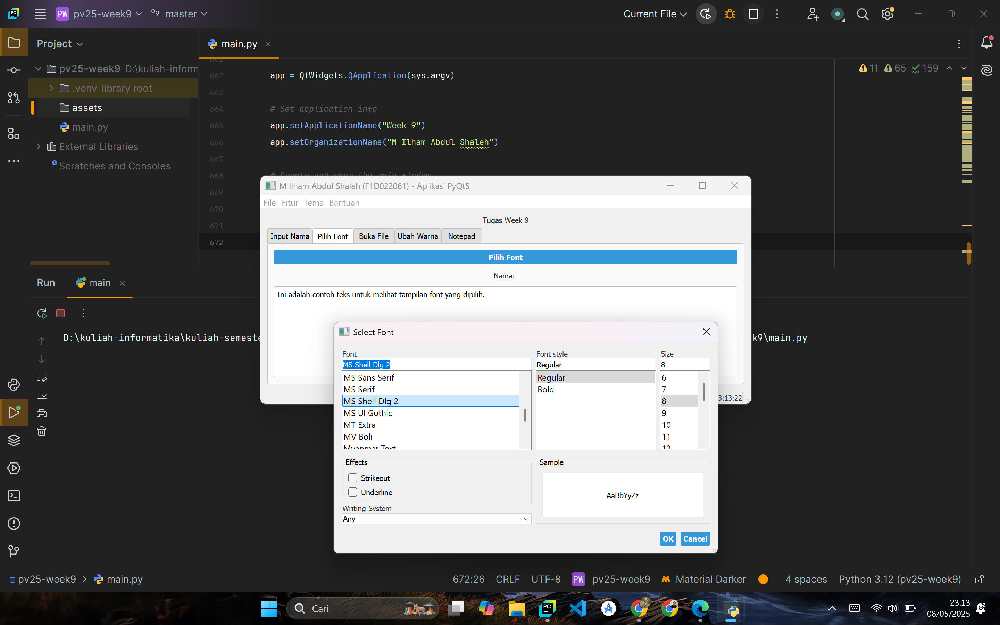 | 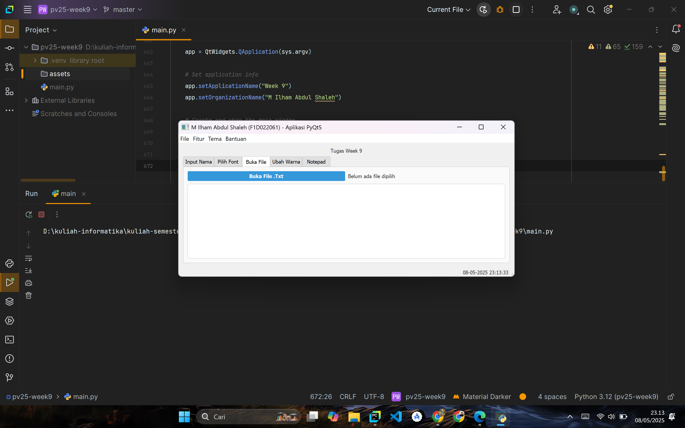 | 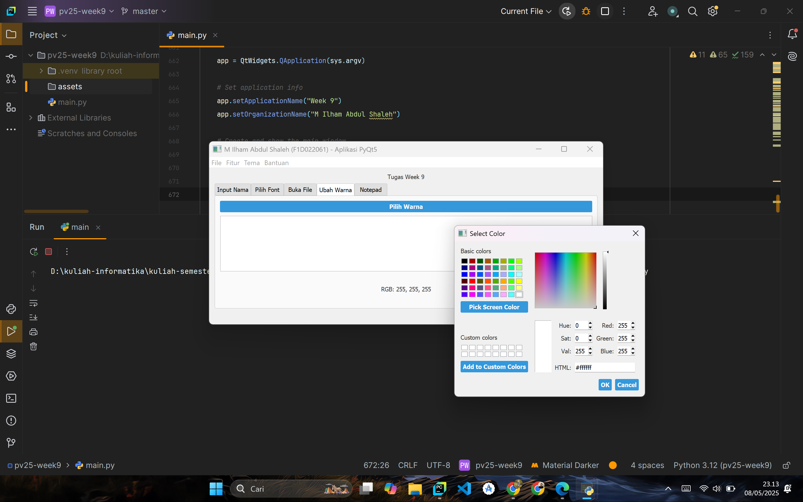 |

| Tampilan 5 | Tampilan 6 | Tampilan 7 | Tampilan 8 |
|------------|------------|------------|------------|
| 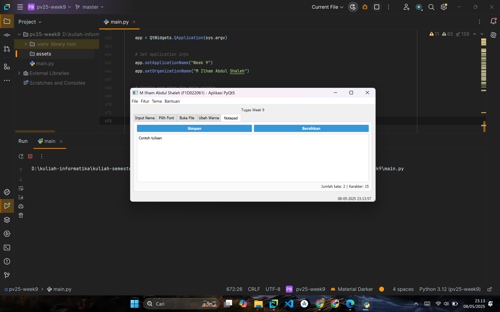 | 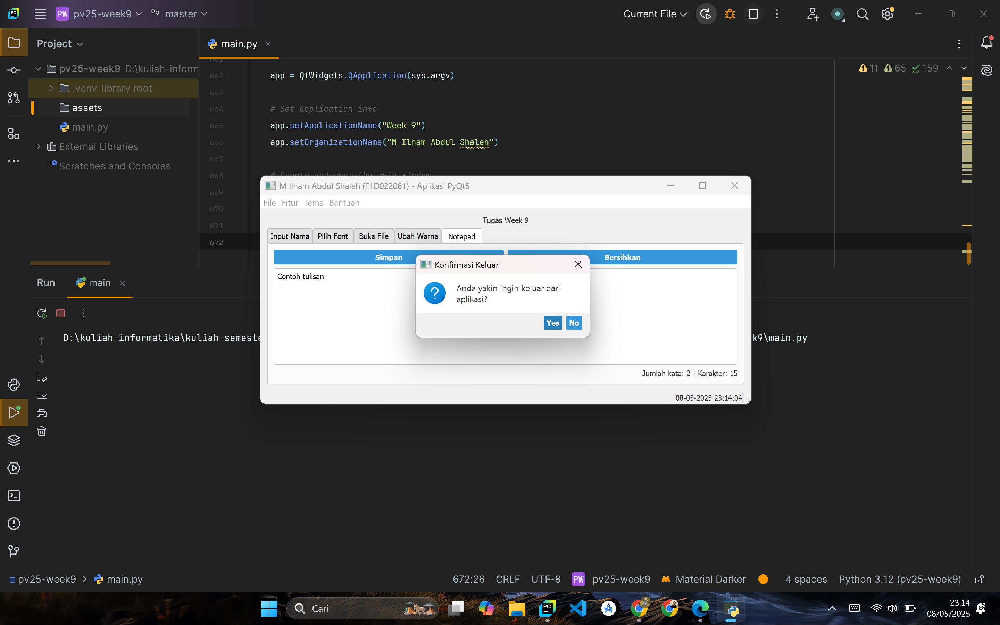 | 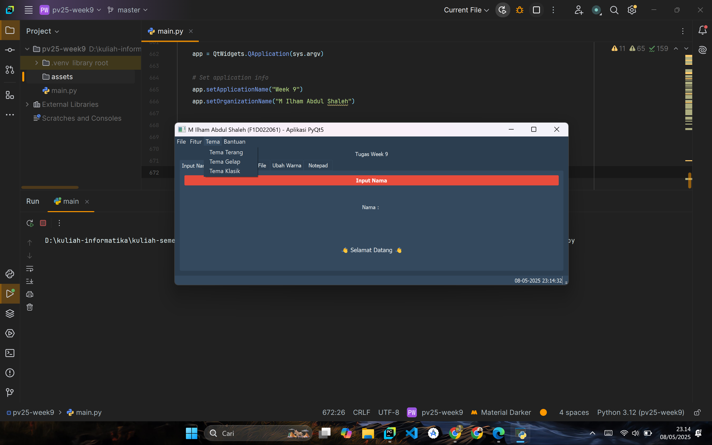 | 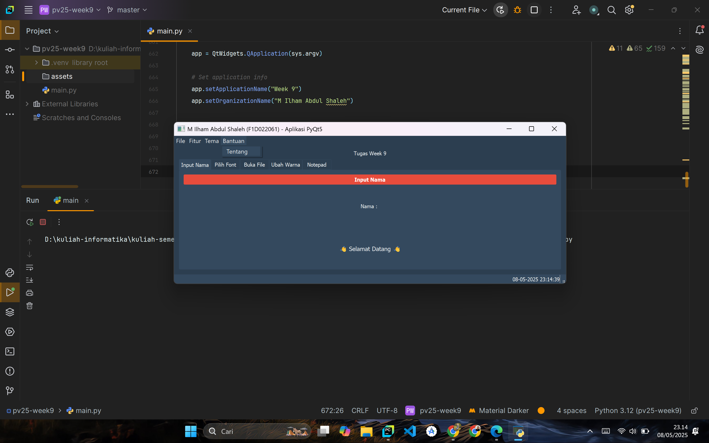 |

| Tampilan 9 |            |            |            |
|------------|------------|------------|------------|
| 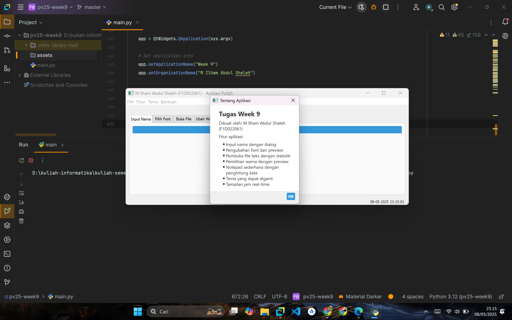 | 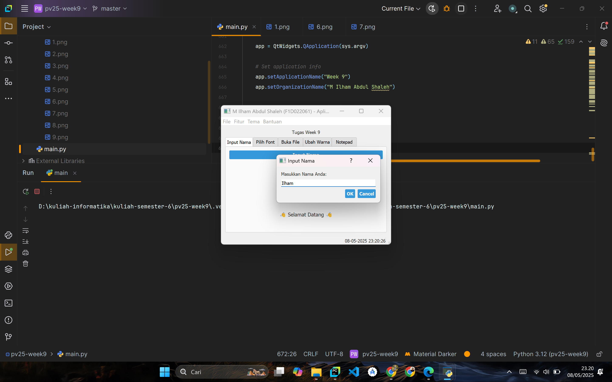 | 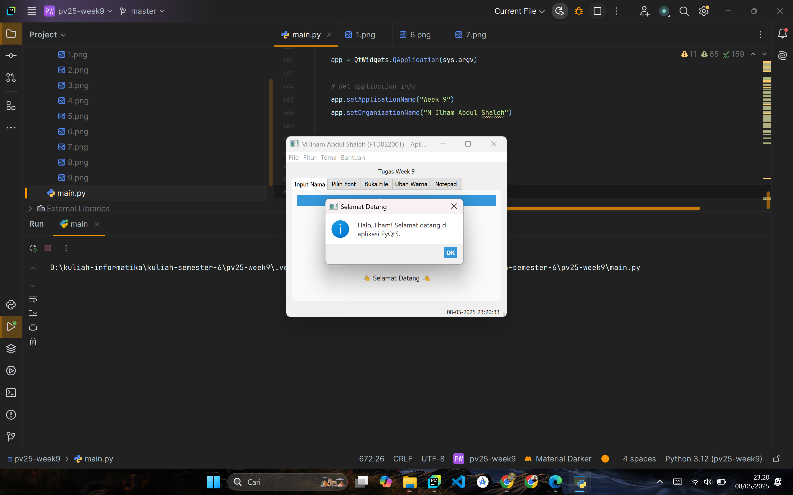 | 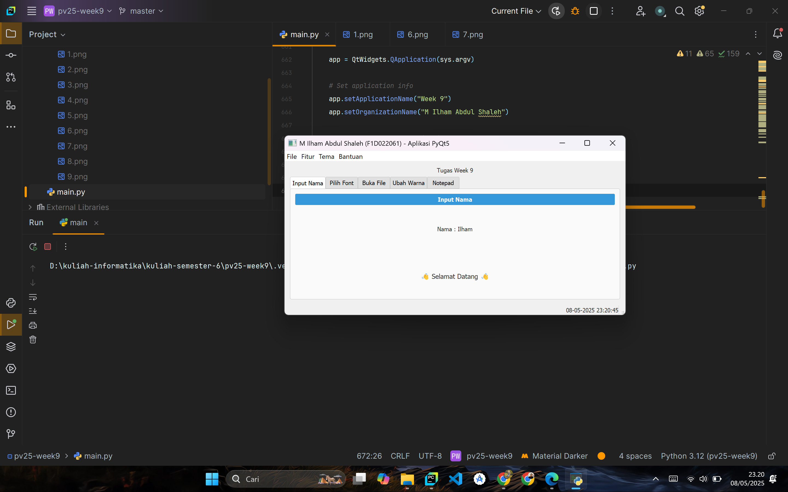 |

---

## 🧱 Catatan Pengembangan

Komponen utama dan teknik yang digunakan dalam pengembangan:
- **QInputDialog** untuk input nama interaktif
- **QFontDialog** untuk pemilihan font
- **QFileDialog** untuk membuka dan menyimpan file
- **QColorDialog** untuk pemilihan warna latar belakang
- **QTextEdit & QTextBrowser** untuk editor teks dan tampilan file
- **QTimer & QDateTime** untuk jam digital real-time di status bar

---

